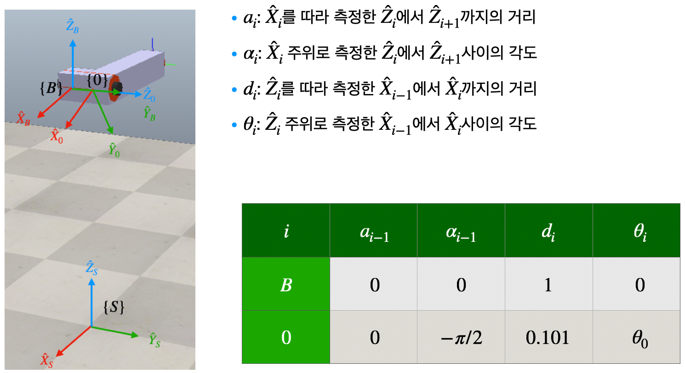
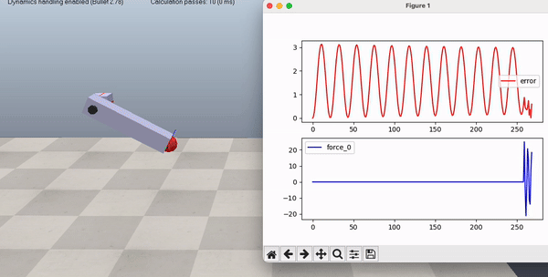
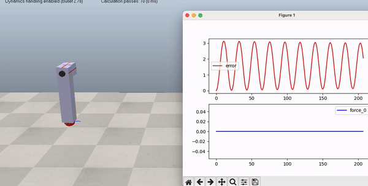
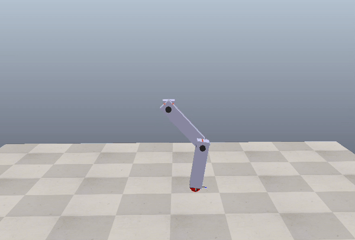
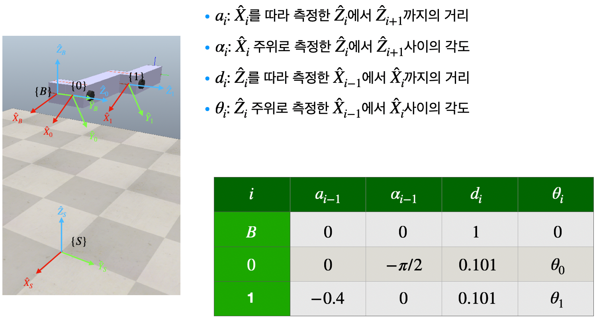
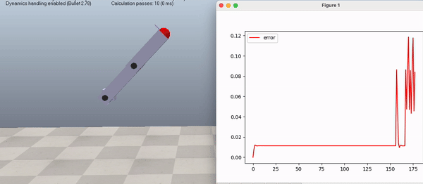
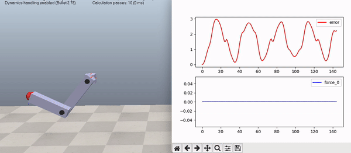
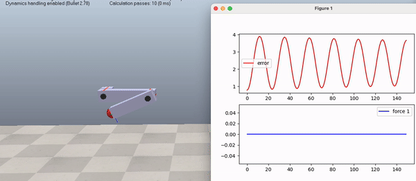
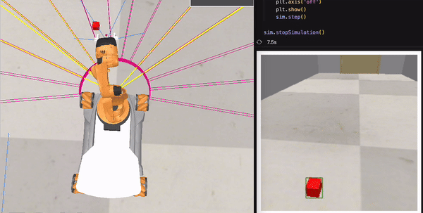

# 1. Env
```
pip install coppeliasim-zmqremoteapi-client
pip install numpy
pip install sympy
pip install scipy
pip install pynput
pip install matplotlib
pip install opencv-python
pip install webcolors
```

# pendulum_1d

## 1. Control by Keyboard [control_by_keyboard.py](./pendulum_1d/control_by_keyboard.py)
- right arrow: positive force
- left arrow: negative force
- q: quit simulator


## 2. Forward Kinematics [forward_kinematics.py](./pendulum_1d/forward_kinematics.py)
- right arrow: positive theta_0
- left arrow: negative theta_0
- q: quit simulator



## 3. Inverse Kinematics [inverse_kinematics.py](./pendulum_1d/inverse_kinematics.py)
- space: random C1_ref
- q: quit simulator


## 4. P Control [force_p_control.py](./pendulum_1d/force_p_control.py)
- space: start control
- q: quit simulator


## 5. PD Control [force_pd_control.py](./pendulum_1d/force_pd_control.py)
- space: start control
- q: quit simulator


## 6. PID Control [force_pid_control.py](./pendulum_1d/force_pid_control.py)
- space: start control
- q: quit simulator


# pendulum_2d

## 1. Control by Keyboard [control_by_keyboard.py](./pendulum_2d/control_by_keyboard.py)
- w: joint_0 positive force
- s: joint_0 negative force
- e: joint_1 positive force
- d: joint_1 negative force
- q: quit simulator


## 2. Forward Kinematics [forward_kinematics.py](./pendulum_2d/forward_kinematics.py)
- w: joint_0 positive theta_0
- s: joint_0 negative theta_0
- e: joint_1 positive theta_1
- d: joint_1 negative theta_1
- q: quit simulator



## 3. Inverse Kinematics [inverse_kinematics.py](./pendulum_2d/inverse_kinematics.py)
- space: random C2_ref
- q: quit simulator


## 4. PID Control (Joint_0 Only) [force_pid_joint_0_control.py](./pendulum_2d/force_pid_joint_0_control.py)
- space: start control
- q: quit simulator


## 5. PID Control (Joint_1 Only) [force_pid_joint_1_control.py](./pendulum_2d/force_pid_joint_1_control.py)
- space: start control
- q: quit simulator


# youBot

## 1. Control by Keyboard [control_by_keyboard.py](./youBot/control_by_keyboard.py)
- arrow: wheel
- w, s: joint-0
- e, d: joint-1
- r, f: joint-2
- t, g: joint-3
- y, h: joint-4
- u, j: gripper
- q: quit simulator

## 2. mapping Distance and angle [mapping_distance_angle.py](./youBot/mapping_distance_angle.py)
- 가정: 정확한 자동차 위치를 알고 있음
- 목표: 100x100 grid 내에서 탐색 가능한 지역을 numpy를 이용해 계산 및 시각화
- 동작확인:


## 3. kinematic analysis [kinematics_analysis.ipynb](./youBot/kinematics_analysis.ipynb)
- 가정: 정확한 자동차 위치와 목표물의 위치를 알고 있음
- 목표: 로봇팔을 제어하여 목표물을 pick & place
- 동작확인:


## 4. target detection [target_detection.ipynb](./youBot/target_detection.ipynb)
- 가정: target은 빨강색 큐브
- 목표: 로봇팔에 달린 카메라의 정보를 이용해 target 검출
- 동작확인:


## 5. pick and place [pick_and_place.py](./youBot/pick_and_place.py)
- 가정: target은 빨강색 큐브
- 목표: 로봇팔에 달린 카메라의 정보를 이용해 target 검출 후 pick & place
- 동작확인:


